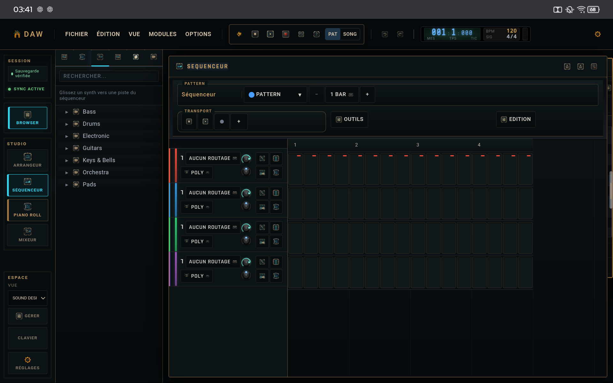
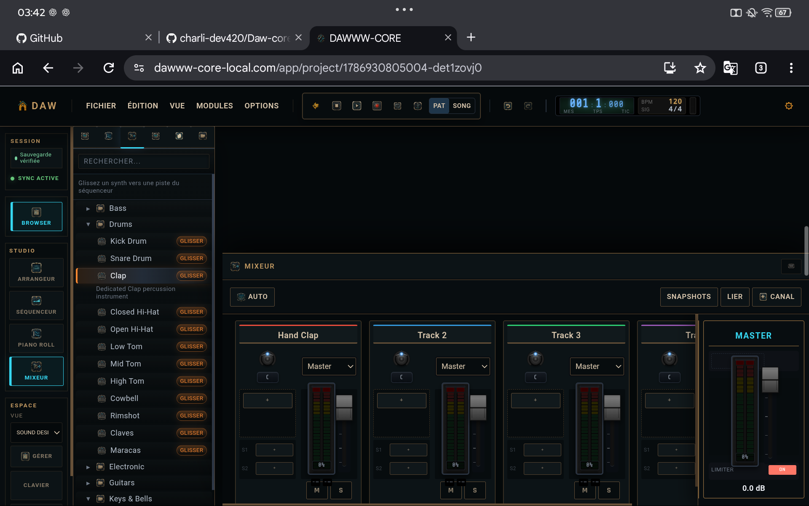
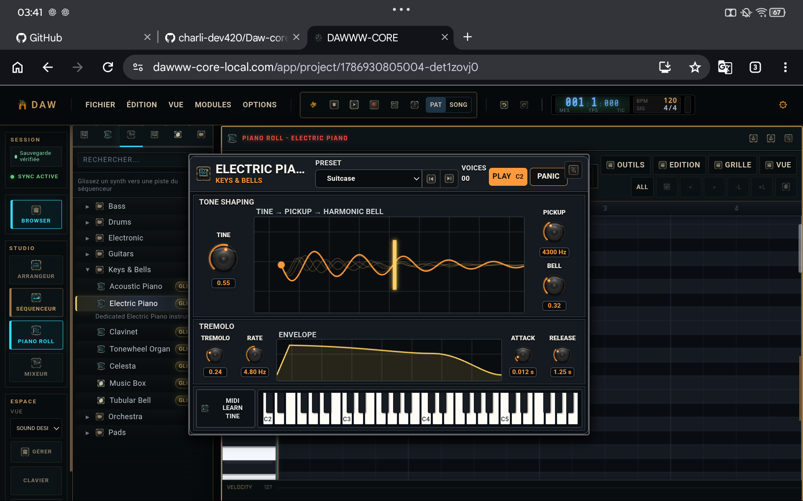
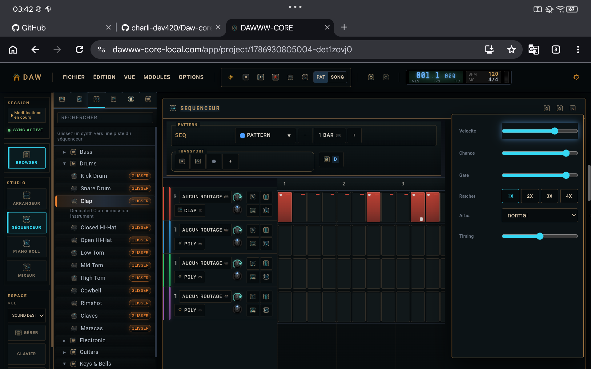

# DAWWW-CORE · Production modules

### Sequencer, piano roll, arranger, mixer and automation working on one project.

[**Open Desktop Studio**](https://dawww-core-local.com/app) · [Main overview](README.md) · [Cross-device](CROSS_DEVICE.md) · [Instruments](INSTRUMENTS.md) · [Effects](EFFECTS.md)

---

DAWWW-CORE separates the major production tasks into dedicated modules instead of trying to put the entire DAW into one oversized editor. The important point is that these surfaces still share the same project, transport, instruments, effects and automation state.

## Sequencer

  

The sequencer is the pattern-oriented writing surface. Tracks can use the instruments available from the Browser and steps can carry more information than a simple on/off trigger.

The detailed step editor supports:

- velocity;
- probability / chance;
- gate length;
- ratcheting;
- articulation;
- timing offset.

  

This allows pattern variation and timing detail to stay inside the sequencer rather than requiring a second tool for every adjustment.

## Piano roll

The piano roll provides note-level editing for pitched material. It shares the same project and instrument context as the sequencer, so note editing does not require exporting MIDI to another application.

Instrument editors can remain directly accessible while working on notes.

  

## Arranger

The arranger turns patterns and musical material into a complete song structure. It provides the timeline used to organize sections, repetitions, transitions and longer-form project progression.

The arranger is part of the same timing model as the sequencer and transport rather than acting as a separate render-only view.

## Mixer

  

The mixer handles the project’s channel-oriented work:

- levels;
- routing;
- processing;
- channel and master control;
- effect integration;
- automation-related mix changes.

The goal is to keep composition and mixing in the same session rather than treating the mix as a disconnected final application.

## Automation

Automation lets parameters change over time as part of the project. It is intended to cover both creative movement and production changes: instrument parameters, effects and mix behavior can evolve with the arrangement instead of being manually reproduced during playback.

## Project I/O and export

The production modules ultimately feed two different output needs:

**Project portability** through `.dw` — the session can be saved, moved, backed up and continued across DAWWW-CORE surfaces.

**Audio delivery** through master and stem-oriented export workflows — the musical result can leave the DAW as audio rather than remaining trapped inside the project.

## Modules are tested as product behavior

The production codebase includes automated and scenario-based checks around the core modules, including sequencer, piano roll, arranger, mixer, transport, routing, effects, automation, project restore and export.

Long-running playback and stress-oriented scenarios are also part of validation. DAWWW-CORE does not claim one universal maximum session size because practical capacity depends on the device, active instruments, effects, routing and sample usage.

## Same modules, same project across devices

The cross-device model does not create a simplified Android project. The `.dw` project carries the state needed by the production workflow, so the same creative session can move between Desktop and Android without introducing a second format.

[Read the cross-device overview →](CROSS_DEVICE.md)

---

[**Open DAWWW-CORE Desktop →**](https://dawww-core-local.com/app)

[Main overview](README.md) · [Cross-device](CROSS_DEVICE.md) · [Instruments](INSTRUMENTS.md) · [Effects](EFFECTS.md)

