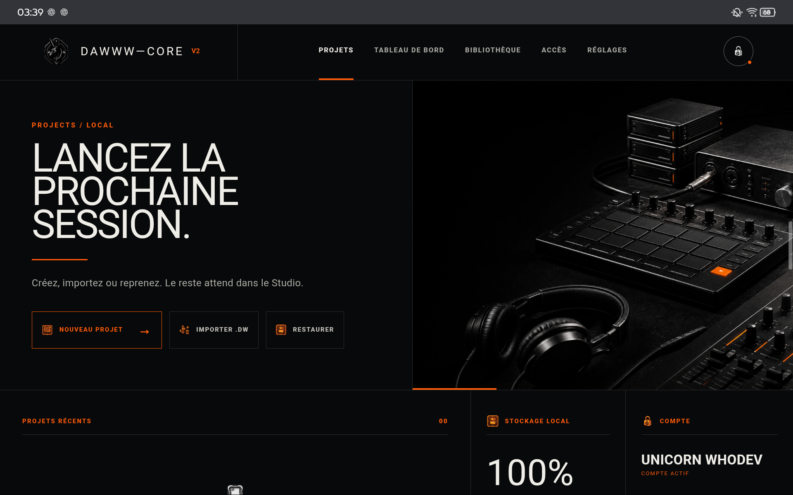
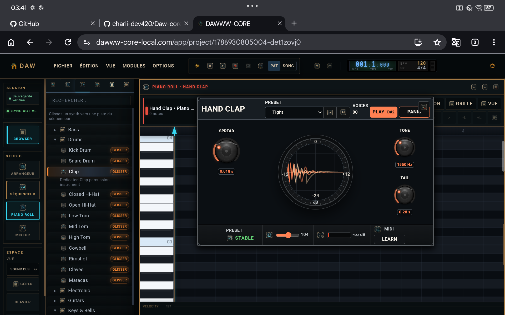

<div align="center">


# DAWWW-CORE

### DAW natif navigateur · runtime local-first · un seul projet portable entre Desktop et Android

DAWWW-CORE est une station audionumérique orientée Desktop construite sur **Web Audio API + AudioWorklet**, avec une couche applicative React/TypeScript, une persistance locale au navigateur et un unique contrat de projet portable `.dw` partagé entre Desktop et Android.

[](https://dawww-core-local.com/app)
[](https://dawww-core-local.com/app)
[](#outils-de-production)
[](#outils-de-production)
[](#architecture-cross-device)
[](#architecture-cross-device)

[**Ouvrir le studio Desktop**](https://dawww-core-local.com/app) · [Produit](https://dawww-core-local.com/fr/studio) · [Documentation](https://dawww-core-local.com/fr/docs) · [Statut](https://dawww-core-local.com/fr/status) · [English](README.md)

</div>

---

<p align="center">
  
</p>

## Vue technique

DAWWW-CORE est un **DAW client-side et local-first**. Le runtime créatif n'est pas hébergé sur un service audio distant et le projet n'est pas défini par une ligne de base de données cloud. Le navigateur exécute le graphe audio, conserve l'état de travail localement et peut sérialiser le projet complet dans un fichier `.dw`.

L'architecture est volontairement séparée :

| Couche | Implémentation | Responsabilité |
| --- | --- | --- |
| **Application / UI** | TypeScript · React · Vite | Workspace, éditeurs, navigation, présentation de l'état |
| **Runtime audio** | Web Audio API | Graphe audio, instruments, effets, mixeur, chaîne master |
| **Timing / workers temps réel** | AudioWorklet | Traitements sensibles au timing hors scheduling React/DOM |
| **Transport / synchronisation** | Transport partagé + modules de sync | Temps musical commun au séquenceur, arrangeur et playback |
| **Runtime projet** | Services serializer / restorer | Conversion entre état vivant et représentation persistante |
| **Persistance locale** | Base/stockage local navigateur | Stockage de travail principal sur Desktop |
| **Projet portable** | `DWFormat` / `DWPackagePipeline` | Export/import `.dw`, vérification, récupération et transfert |
| **Distribution Desktop** | Web app + runtime orienté PWA | Accès navigateur direct, comportement proche d'une app installée |
| **Distribution Android** | Runtime Android Capacitor | Future surface sur abonnement utilisant exactement le même contrat projet |
| **Validation** | Vitest · Playwright · gates de certification dédiés | Unitaires, intégration, portabilité, playback, stress et release |

La frontière principale est simple : **React ne sert pas de scheduler audio**. Le rendu UI reste dans la couche application ; les traitements sensibles au temps restent dans le runtime audio et les chemins AudioWorklet.

## Fonctionnement du moteur audio

Le moteur audio s'exécute sur la machine de l'utilisateur.

Un projet restauré reconstruit un graphe Web Audio : les instruments alimentent les pistes, les pistes traversent leurs traitements et routages, le mixeur agrège le signal puis alimente la chaîne master. Le séquenceur et l'arrangeur utilisent le même transport partagé, afin que le temps musical ne dépende pas du rythme de rendu des composants React.

AudioWorklet est utilisé pour les tâches où le scheduling JavaScript du thread principal serait trop fragile. Le code contient notamment des chemins dédiés pour l'horloge/timing ainsi que certains processors/analyzers.

La lecture Desktop normale ne nécessite donc **aucun rendu audio distant**. En contrepartie, la capacité temps réel d'une session dépend directement du navigateur, du CPU, de la mémoire, du périphérique audio et de la complexité du graphe actif.

L'export audio utilise un chemin de rendu distinct de la lecture interactive. Des services exporter/render dédiés et des tests de parité permettent de vérifier le rendu sans dépendre de l'interface.

## Outils de production

DAWWW-CORE expose plusieurs surfaces DAW séparées mais connectées au même runtime projet.

| Surface | Capacités actuelles | Validation dans le dépôt de production |
| --- | --- | --- |
| **Transport** | Play/stop, temps projet, état de timing partagé | Fixtures playback + profils de certification transport |
| **Séquenceur** | Pistes de pattern, programmation par steps, routage instrument | Fixture module + fixture stress |
| **Propriétés de step** | Vélocité, probabilité/chance, gate, ratchet, articulation, décalage timing | Couverture séquenceur/runtime |
| **Piano roll** | Édition MIDI au niveau des notes | Fixture module + fixture stress |
| **Arrangeur** | Timeline et structure du morceau | Fixture module + fixture stress |
| **Mixeur** | Canaux, niveaux, routage, sends/traitements, master | Couverture unitaire + scénarios routage/PDC/sends |
| **Automation** | Automation de paramètres et chemins live d'effets | Scénario dédié automation/effects |
| **I/O projet** | Sauvegarde/restauration locale, import/export `.dw` | Suite de preuve `.dw` + tests serializer/restorer |
| **Export audio** | Master et stems, WAV de base, MP3 selon capability | Scénarios export, export long, budgets de performance |

### 51 instruments intégrés

Le registre intégré contient actuellement **50 moteurs de synthèse dédiés plus un sampler**.

- **12 moteurs orchestraux :** violon, alto, violoncelle, contrebasse, trompette, cor, trombone, tuba, flûte, hautbois, clarinette, basson
- **12 moteurs drums :** kick, snare, hand clap, hi-hat fermé/ouvert, tom bas/mid/aigu, cowbell, rimshot, claves, maracas
- **3 basses :** sub, acid, Reese
- **7 moteurs électroniques :** mono lead, poly synth, pluck, arpeggio synth, chiptune, FM keys, noise/transition FX
- **5 pads :** warm, glass, choir, evolving, ambient
- **7 keys/bells :** piano acoustique, piano électrique, clavinet, orgue tonewheel, celesta, music box, tubular bell
- **4 guitares :** nylon, steel-string, clean electric, driven electric
- **1 sampler** pour les instruments basés sur des échantillons

Plusieurs familles disposent d'éditeurs dédiés. L'interface peut donc exposer les contrôles liés au vrai modèle de synthèse au lieu de tout réduire à une liste générique de paramètres.

### 16 effets intégrés

`EQ paramétrique 8 bandes` · `Compressor` · `Convolution Reverb` · `Delay synchronisé au tempo` · `Chorus` · `Flanger` · `Phaser` · `Distortion` · `Filter` · `Gate` · `Limiter` · `Saturator` · `Tremolo` · `Vibrato` · `Bitcrusher` · `Utility`

Ces effets appartiennent au modèle mixeur/automation et leur état est sérialisé avec le projet.

## Surfaces actuelles du Studio

<table>
  <tr>
    <td width="50%" valign="top">
      <br />
      <sub><b>Séquenceur</b> — pistes de pattern et routage instrument dans le runtime projet partagé.</sub>
    </td>
    <td width="50%" valign="top">
      <br />
      <sub><b>Propriétés par step</b> — vélocité, chance, gate, ratchets, articulation et décalage timing.</sub>
    </td>
  </tr>
  <tr>
    <td width="50%" valign="top">
      <br />
      <sub><b>Mixeur</b> — routage, inserts/traitements, niveaux et étage master.</sub>
    </td>
    <td width="50%" valign="top">
      <br />
      <sub><b>Piano roll + device</b> — édition des notes et contrôles instrument restent connectés au même projet vivant.</sub>
    </td>
  </tr>
  <tr>
    <td colspan="2" align="center" valign="top">
      <br />
      <sub><b>Éditeur dédié</b> — contrôles propres au moteur de synthèse au lieu d'un dump générique de paramètres.</sub>
    </td>
  </tr>
</table>

## Contrat projet `.dw`

`.dw` est **l'unique contrat projet** de DAWWW-CORE.

Le runtime vivant est sérialisé via `ProjectRuntimeSerializer` et les couches `DWFormat` / `DWPackagePipeline`. Le chemin inverse reconstruit le runtime via `ProjectRuntimeRestorer`. Ce package n'est ni un format d'échange allégé ni un sous-ensemble Android : il représente le projet portable complet.

Un `.dw` valide doit préserver les informations nécessaires à la reconstruction de la session, notamment la structure du projet, les snapshots instruments/effets et les assets sampler référencés. Les critères de certification cross-device couvrent explicitement :

- import accepté ;
- checksum valide ;
- assets sampler présents ;
- snapshots instruments/effets conservés ;
- réexport possible depuis la surface cible.

La suite de preuve `.dw` couvre également la validation de format, les invariants de portabilité, le fuzzing, la vérification d'export, la sérialisation/restauration runtime, le rendu moteur, la parité audio, le **rendu cross-device** et les tests de **production parity**.

## Architecture cross-device

DAWWW-CORE est **100 % cross-device par contrat projet**.

Desktop et Android sont deux surfaces applicatives au-dessus du même modèle projet, pas deux produits possédant des fichiers partiellement compatibles.

```text
Runtime Desktop Web
        │
        ├── ProjectRuntimeSerializer
        ▼
     projet .dw
        │
        ├── ProjectRuntimeRestorer
        ▼
Runtime Android / Capacitor
        │
        ├── ProjectRuntimeSerializer
        ▼
     même .dw
        │
        └── retour Desktop sans conversion
```

Le contrat est volontairement strict :

- **un seul schéma `.dw`** pour les deux plateformes ;
- **les mêmes sémantiques projet** pour l'arrangement, les données MIDI/notes, instruments, effets, automation et état de routage représentés par le projet ;
- **les mêmes règles serializer/restorer** ;
- **import et réexport dans les deux sens** ;
- **aucun format projet Android réduit** ;
- **aucune conversion pour passer Desktop → Android → Desktop** ;
- **le cloud n'est pas le mécanisme de compatibilité**.

Android reste une application publique à venir et sera proposée sur abonnement. Cela concerne la distribution et la qualification de release, **pas le contrat cross-device**. La surface Android implémente le modèle projet complet de DAWWW-CORE, pas un mode compagnon ou viewer réduit.

| Surface | Disponibilité | Modèle d'accès | Modèle projet |
| --- | --- | --- | --- |
| **Desktop Web** | Disponible maintenant | Sans paiement | Runtime `.dw` complet |
| **Android** | À venir | Abonnement | Même contrat runtime `.dw` complet |
| **Transfert projet** | Desktop ↔ Android | Fichier/transfert local et futures couches de service | Aucune conversion |
| **Sync cloud projet** | Non requise | Optionnelle | Jamais nécessaire à l'existence du projet |

## Persistance, récupération et stockage local

Desktop utilise l'infrastructure de stockage/base locale du navigateur comme persistance de travail principale.

La stack projet contient des mécanismes explicites de sauvegarde et récupération : sérialisation/restauration, état de confiance de sauvegarde, recovery flows et chemin de réparation de la base locale. `.dw` constitue la frontière durable externe : une fois exporté, le projet existe indépendamment de la base du navigateur.

Le stockage navigateur ne possède pas de quota universel fixe. La capacité et les politiques d'éviction dépendent du navigateur, du profil, du système et de l'appareil. DAWWW-CORE ne peut donc pas annoncer un volume unique valable sur toutes les machines.

Les grosses bibliothèques d'échantillons et de nombreux projets locaux restent bornés par la politique de stockage de l'hôte. Pour les projets importants, un export `.dw` périodique permet de conserver une copie portable hors de la persistance du navigateur.

## Stratégie de validation

Le dépôt de production utilise plusieurs niveaux de validation plutôt qu'un score global unique.

### Tests unitaires et intégration

**Vitest** couvre le moteur audio, le stockage, le format projet, les instruments/effets, la sérialisation/restauration et les autres composants runtime.

La suite critique `test:dw:proof` possède un dernier comptage documenté de **459 tests**. Sa couverture sélectionnée inclut :

- `DWPackagePipeline` ;
- `DWPortabilityInvariants` ;
- `DWFormat` et fuzz tests ;
- `DWExportVerification` ;
- `DWCrossDeviceRender` ;
- `DWProductionParity` ;
- `ProjectRuntimeSerializer` / `ProjectRuntimeRestorer` ;
- `EngineRenderService` ;
- `AudioParity.integration` ;
- playback fixture builders et production synth gates.

### Certification des modules Desktop

Des profils dédiés existent pour :

- séquenceur, arrangeur, piano roll et mixeur avec **fixtures module de 1 minute** ;
- **fixtures stress de 1 minute** dédiées aux mêmes modules ;
- transport / état partagé ;
- stabilité **1 heure continuous-work** ;
- stabilité **1 heure stress** ;
- stabilité **1 heure alternating-sync** ;
- certification Desktop complète et release-candidate gate scoped.

### E2E et performance

**Playwright** est utilisé pour les scénarios E2E/performance navigateur. Le dépôt contient également des rapports de performance, des regression gates et des tests de budget spécifiques aux exports/stems.

### Preuve de release conservée

Le dernier gel Desktop conservé dans la documentation date du **18 juillet 2026**. À ce gel :

- les 9 composants Desktop suivis étaient verts par preuves composées ;
- le `complete-gate` Desktop visible indiquait **12/12 passed** ;
- `findings=0` et `advisoryFindings=0` étaient conservés pour ce gate ;
- un gate de lecture Desktop longue avait atteint **55 minutes** ;
- la preuve d'import/export `.dw` était conservée.

L'application a évolué après ce gel : ces chiffres représentent donc des preuves techniques retenues, pas une affirmation selon laquelle chaque commit ultérieur hérite automatiquement du même résultat. Une release courante est rejouée via le release gate scoped.

## Enveloppe de session et limites pratiques

DAWWW-CORE ne publie actuellement **aucune limite dure arbitraire** sur le nombre de pistes, le nombre de notes, la durée projet, le nombre de voix simultanées ou la taille `.dw`. Le moteur Desktop s'exécute localement, donc un chiffre unique serait trompeur entre deux machines très différentes.

La limite pratique d'une session dépend principalement de :

- **budget CPU temps réel** — voix de synthèse, effets, analyzers et routages complexes consomment du temps Web Audio ;
- **mémoire** — samples décodés, buffers, états de rendu et gros projets utilisent la mémoire du process navigateur ;
- **quota de stockage navigateur** — projets locaux et assets partagent une capacité imposée par l'hôte ;
- **charge d'export** — masters longs et nombreux stems augmentent temps de rendu et mémoire temporaire ;
- **périphérique audio / implémentation navigateur** — latence et capacité stable varient selon les systèmes.

Les fixtures module/stress de 1 minute et profils de stabilité d'1 heure sont des **enveloppes de validation**, pas des promesses de taille illimitée. La preuve de playback de 55 minutes démontre un chemin long testé, sans prétendre qu'un graphe arbitrairement complexe fonctionnera indéfiniment sur tous les appareils.

Pour les sessions très lourdes en samples, très polyphoniques ou très chargées en traitements, la limite effective reste donc la machine locale. Les projets importants doivent aussi être exportés régulièrement en `.dw` afin que la récupération ne dépende pas d'un seul profil navigateur.

### Limites export

**WAV** constitue le chemin d'export de base. **MP3 est capability-gated** et dépend du chemin runtime disponible ; le projet n'intègre pas de fallback universel LAME/Shine/FFmpeg/libmp3lame dans le runtime normal.

### Variabilité navigateur

Comportement AudioWorklet, codecs disponibles, quotas de stockage, mémoire et latence du périphérique audio varient selon navigateur/plateforme. Une combinaison navigateur/OS ne doit être présentée comme certifiée qu'après passage explicite des checks correspondants.

### État de release Android

Android possède déjà un chemin de build Capacitor ainsi que des outils dédiés au build, aux worklets, à la sécurité et aux budgets de bundle. L'application Android publique reste à venir. La qualification des appareils appartient au processus de release Android ; **le contrat projet reste le même contrat `.dw` cross-device complet décrit ci-dessus.**

## Scope actuel

Le produit actuel ne dépend pas de :

- synchronisation cloud obligatoire des projets ;
- collaboration temps réel ;
- iOS ;
- marketplace de plugins tiers.

L'effort d'ingénierie reste concentré sur le runtime audio, les surfaces de production, la portabilité/récupération des projets et un modèle projet Desktop ↔ Android complet et unique.

## Stack publique

`TypeScript` · `React` · `Vite` · `Web Audio API` · `AudioWorklet` · `PWA` · stockage local navigateur · `Capacitor` pour Android

Le dépôt de production privé contient également des couches dédiées à la QA, compatibilité, récupération, observabilité, sécurité et release. Ce dépôt public présente le produit sans exposer les détails opérationnels ou sensibles.

## Ressources

- **Studio Desktop** — https://dawww-core-local.com/app
- **Présentation produit** — https://dawww-core-local.com/fr/studio
- **Documentation** — https://dawww-core-local.com/fr/docs
- **Tutoriels** — https://dawww-core-local.com/fr/tutorials
- **FAQ** — https://dawww-core-local.com/fr/faq
- **Statut** — https://dawww-core-local.com/fr/status
- **Roadmap** — https://dawww-core-local.com/fr/roadmap
- **Changelog** — https://dawww-core-local.com/fr/changelog
- **Contact** — https://dawww-core-local.com/fr/contact

## À propos de ce dépôt

`Daw-core-desktop` est la **vitrine technique et produit publique de DAWWW-CORE**.

L'application de production et le moteur audio restent privés. Ce dépôt documente l'architecture, les surfaces disponibles, la stratégie de validation, la portabilité projet, le modèle plateforme et les limites actuelles sans publier les configurations de déploiement, contrats fournisseurs, mécanismes de sécurité ou autres éléments sensibles.

---

<div align="center">

### Un seul projet. Desktop et Android. Aucune couche de conversion.

[**Ouvrir DAWWW-CORE Desktop**](https://dawww-core-local.com/app)

</div>
